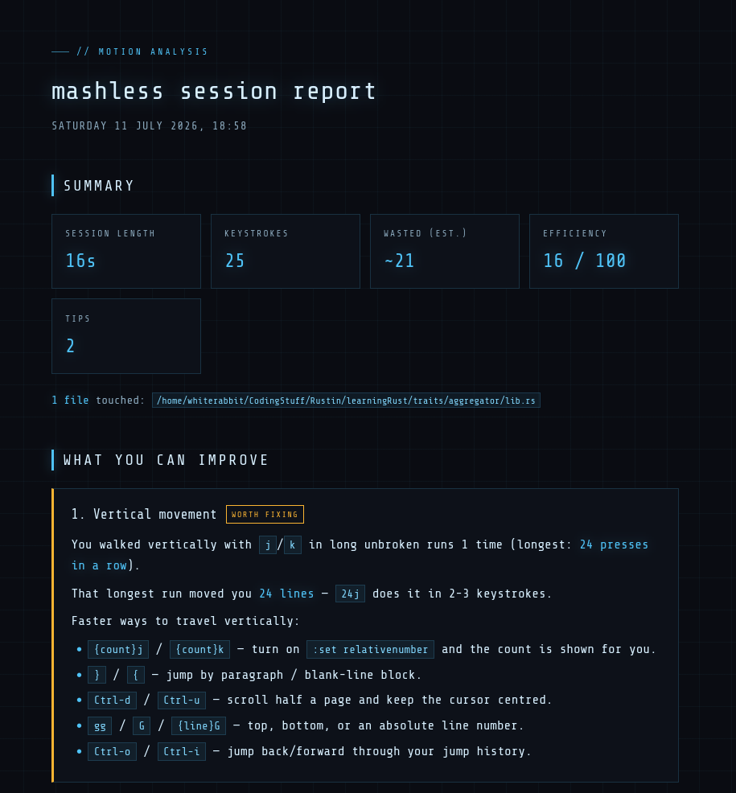

# mashless

A Neovim plugin that watches the Vim motions you actually use, and when you
quit Neovim it opens an HTML readout **in your browser** showing what you could
have done more efficiently — like reaching for `f{char}` instead of mashing
`l`, or `12G` instead of holding `j`.

The brain is a **Rust** binary; a thin Lua shim only does the things that must
happen inside Neovim (capturing keys, autocmds, commands) and forwards every
event to Rust over msgpack-RPC.



## What it does

- Records every normal- and visual-mode keystroke for the session (insert-mode
  text is ignored; insert-mode arrow keys are noticed).
- Tracks cursor positions, so suggestions are concrete: *"that run moved you 9
  lines — `9j` does it in 3 keystrokes"*.
- On `:q`, analyzes the session, writes a timestamped HTML report, and opens it
  in your default browser.

### What it flags

| Pattern | Suggestion |
| --- | --- |
| Long `j`/`k` runs | `{count}j`, `}`/`{`, `<C-d>`/`<C-u>`, `{n}G` |
| Long `h`/`l` runs | `w`/`b`/`e`, `f{char}`/`t{char}`, `0`/`^`/`$` |
| Arrow keys (normal mode) | `h` `j` `k` `l` |
| Arrow keys (insert mode) | `<Esc>` + motion, or `<C-o>{motion}` |
| Repeated `x` | `{count}x`, `dw`, `D`, `diw`/`daw` |
| Repeated `dd` | `{count}dd`, `dap`/`dip`, visual `V` + `d` |
| Long `w`/`b`/`e` chains | `f{char}`, `/search` |
| Long `u` streaks | `{count}u`, `:earlier`, `g-` |

## Reports

Written to `stdpath('data')/mashless/` — on Linux that is
`~/.local/share/nvim/mashless/mashless-YYYY-MM-DD-HHMMSS.html` — and opened in
your default browser via the OS handler (`xdg-open` / `open` / `start`).

Each report is a fully self-contained HTML page — no network needed, even the
font is embedded — styled as a dark "cyberpunk" readout (cyan-on-black, grid
overlay, Share Tech Mono). It shows a summary (session length, keystrokes, an
efficiency score, an estimate of wasted keystrokes), the ranked tips, and a
motion cheat-sheet.

## Commands

- `:Mashless` — open the latest report in the browser.
- `:MashlessReport` — generate and open a report now, without quitting.

## Requirements

- Neovim 0.10+ (for `vim.on_key`'s `typed` argument).
- A Rust toolchain (`cargo`) to build the binary once.

## Install

mashless runs straight from a local clone. Clone it, **build the Rust binary
once**, then point your plugin manager at the directory.

**1. Clone it somewhere and build.**

```sh
git clone <repo-url> ~/mashless
cd ~/mashless
cargo build --release   # produces target/release/mashless
```

The shim finds the binary relative to itself (`target/release/mashless`), so no
`PATH` setup is needed. Re-run `cargo build --release` after pulling updates.

**2. Tell your plugin manager to load it from that directory.**

### lazy.nvim

```lua
{
  dir = vim.fn.expand('~/mashless'), -- the path you cloned into
  name = 'mashless',
  lazy = false,                      -- load at startup so motions are recorded from the first key
  build = 'cargo build --release',   -- lazy.nvim rebuilds the binary on update
  config = function()
    require('mashless').setup()
  end,
}
```

### packer.nvim

```lua
use {
  '~/mashless', -- the path you cloned into
  run = 'cargo build --release',
  config = function() require('mashless').setup() end,
}
```

### Plain `:set runtimepath` (no plugin manager)

```lua
vim.opt.runtimepath:append(vim.fn.expand('~/mashless'))
require('mashless').setup()
```

## Configuration

```lua
require('mashless').setup({
  enabled = true,
  output_dir = vim.fn.stdpath('data') .. '/mashless',
  min_keys = 1,    -- skip the report for trivially short sessions
  vmin = 3,        -- consecutive j/k before it counts as a streak
  hmin = 5,        -- consecutive h/l before it counts as a streak
  xmin = 3,        -- consecutive x before it counts as a streak
  notify_on_enter = true,
})
```

## How it works

```
Neovim
  └─ lua/mashless/init.lua      thin shim
        vim.on_key ─┐           (capture: only genuinely *typed* keys)
        autocmds  ──┤ msgpack-RPC (jobstart rpc=true)
        commands  ──┘
                    ▼
     target/release/mashless    Rust core
        recorder  → session state
        analyzer  → inefficiency findings
        report    → HTML + opens the browser
```

Neovim's `vim.on_key()` is the only way to see every keystroke, and it has no
RPC binding — so key capture stays in Lua. The shim keeps **only** the keys the
user actually typed (`typed` is non-empty); keys Neovim generates internally
(mapping right-hand sides, or `x` re-feeding `dl`) are dropped, so runs like
`xxx` stay intact. Each key, plus cursor moves and buffer visits, is forwarded
to the Rust process, which owns the session, runs the analysis, writes the
report, and launches your browser.

Capture is wrapped in `pcall` throughout — a bug in mashless can never break
your editing.

## Development

```sh
cargo build --release   # build the binary
cargo test              # analyzer unit tests
```
